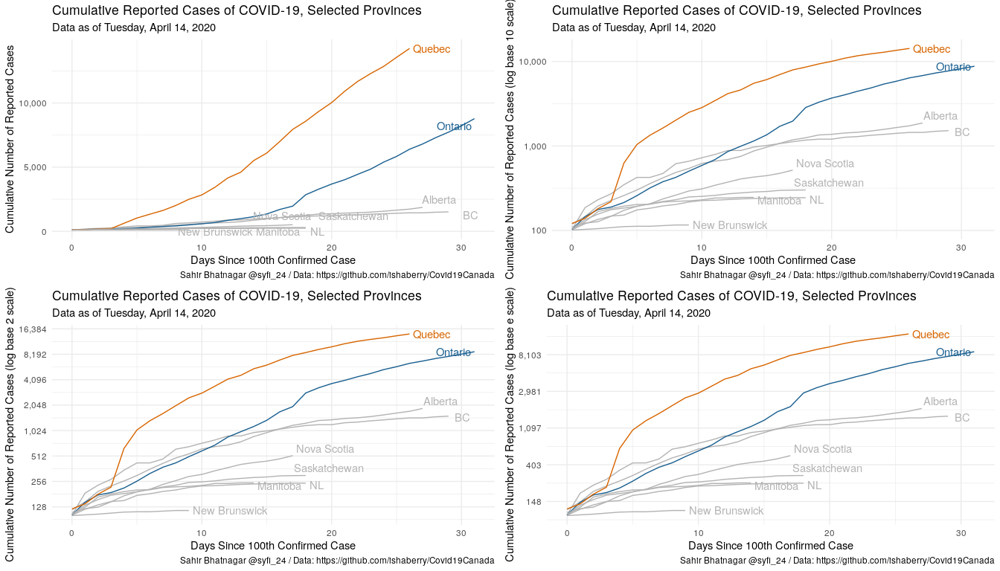
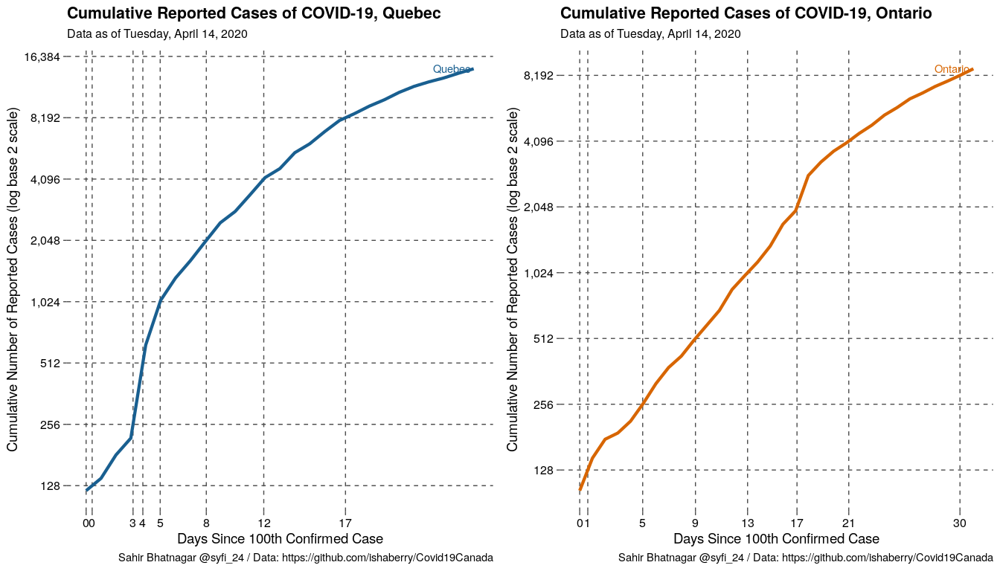
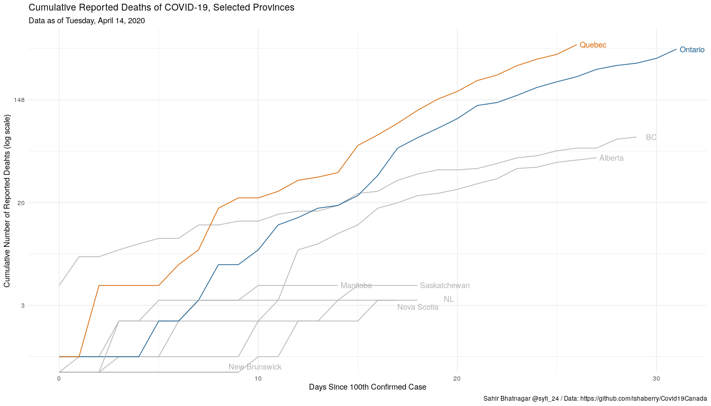
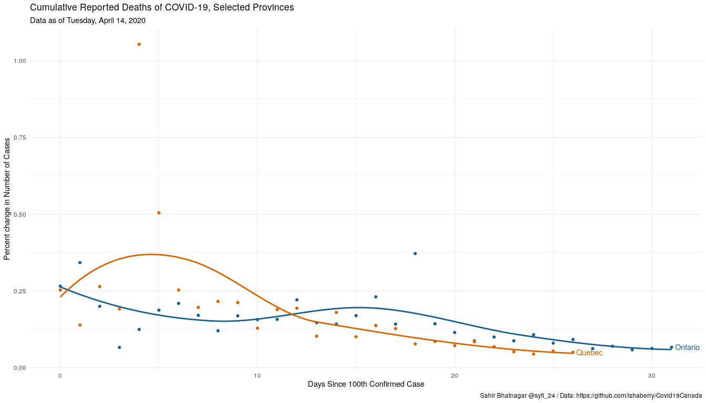
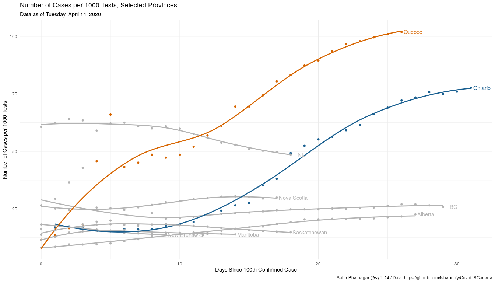
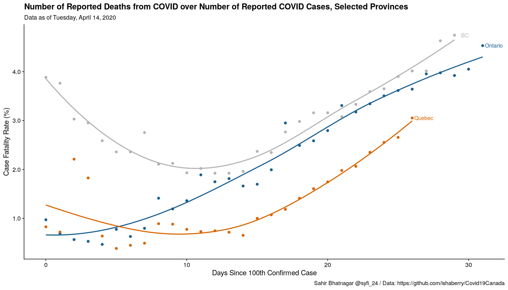
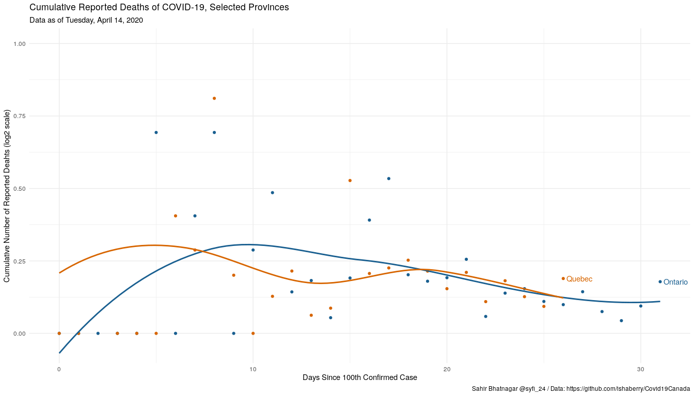

# Load Libraries and set paths

```r
knitr::opts_chunk$set(echo = TRUE, warning = FALSE, fig.width = 14, fig.height = 8, message = FALSE)
pacman::p_load(ggplot2) # plotting functions
pacman::p_load(cowplot) # combine plots
pacman::p_load(ggrepel) # repel label text
pacman::p_load(dplyr) # data wrangling
pacman::p_load(jsonlite)
pacman::p_load(data.table)
pacman::p_load(tidyverse)
pacman::p_load(tsibble) # for difference function
pacman::p_load(lubridate)
pacman::p_load(colorspace)
pacman::p_load(ggthemes)
pacman::p_load(locfit)
pacman::p_load(here)
pacman::p_load(paletteer)
pacman::p_load(prismatic)

#Set Path
covidPath <- here::here('data/canada/')
covidFigPath <- here::here('figures/')

today <- format(Sys.Date(), "%Y-%B-%d")

# Province name abbreviations
abbreviations <- read.csv(paste0(covidPath, "pr_name_abb.csv")) 
```

# Load Data

```r
##################################################
# COVID-19 Canada Open Data Working Group. 
# Epidemiological Data from the COVID-19 Outbreak in Canada. 
# https://github.com/ishaberry/Covid19Canada.
##################################################

#github path
ishaberry_data_url <- "https://raw.githubusercontent.com/ishaberry/Covid19Canada/master/"

##################################################
# Download latest data
##################################################

# update_time.txt: Date and time of update
download.file(paste0(ishaberry_data_url,"update_time.txt"), 
              destfile = paste0(covidPath, "update_time.txt"), quiet = T)
updatetime <- read.table(paste0(covidPath, "update_time.txt"))
today <- as.POSIXct(paste(updatetime[,1],updatetime[,2],updatetime[,3]))
today
```

```
## [1] "2020-04-14 20:00:00 EDT"
```

```r
##################################################


download_covid <- function(type, 
                           path = covidPath, 
                           update_time = updatetime, 
                           url = ishaberry_data_url){

  most_recent_data_update <- as.POSIXct(paste(update_time[,1],update_time[,2],update_time[,3]))
  
  if (file.exists(paste0(path, type))) {
    # only download if out of date
    if (most_recent_data_update > file.info(paste0(path, type))[["ctime"]]) {
      message(sprintf("%s out of date. downloading %s version", type, most_recent_data_update))
      download.file(paste0(url,type), 
                    destfile = paste0(covidPath, type), quiet = T)
    } else {
      message(sprintf("%s is up to date. no need to download again", type))
    }
  } else {
    message(sprintf("%s does not exist. downloading %s version to %s from %s", type, most_recent_data_update, path, url))
    # or download if file doesnt exisit
    download.file(paste0(url, type), 
                  destfile = paste0(path, type), quiet = T)
  }
  
  DT <- read.csv(paste0(path, type)) 
  DT
}

cases <- download_covid(type = "cases.csv") %>%
    mutate(date_report = as.Date(date_report, "%d-%m-%Y"))

# head(cases)

# mortality.csv: Individual-level mortality
mortality <- download_covid(type = "mortality.csv")
# mortality

# recovered_cumulative.csv: Time series of cumulative recovered
recovered_cumulative <- download_covid(type = "recovered_cumulative.csv")
# recovered_cumulative

# testing_cumulative.csv: Time series of cumulative testing
testing_cumulative <- download_covid("testing_cumulative.csv")
# testing_cumulative
```

## Cumulative Cases by Province

```r
#health_region
mortality <- mortality %>% 
  select(death_id, province_death_id, age, sex, province, date_death_report) %>% 
  rename(Date = date_death_report) %>% 
  mutate(Date = as.Date(Date, "%d-%m-%Y")) %>% 
  group_by(province, Date) %>% 
  dplyr::summarise(deaths = n()) 

mortality$province %>% levels
```

```
## [1] "Alberta"      "BC"           "Manitoba"     "NL"           "Nova Scotia" 
## [6] "Ontario"      "Quebec"       "Saskatchewan"
```

```r
testing_cumulative <- testing_cumulative %>% 
  rename(Date = date_testing, cu_testing = cumulative_testing) %>% 
  mutate(Date = as.Date(Date, "%d-%m-%Y"))

recovered_cumulative <- recovered_cumulative %>% 
  rename(Date = date_recovered, cu_recovered = cumulative_recovered) %>% 
  mutate(Date = as.Date(Date, "%d-%m-%Y"))


cases <- cases %>% 
  select(case_id, provincial_case_id,age,sex,province, date_report) %>% 
  rename(Date = date_report) %>% 
  group_by(province, Date) %>% 
  dplyr::summarise(cases = n()) 


DT <- cases %>% 
  full_join(mortality, by = c("Date","province")) %>% 
  full_join(testing_cumulative, by = c("Date","province")) %>% 
  full_join(recovered_cumulative, by = c("Date","province")) %>% 
  group_by(province) %>% 
  arrange(Date) %>% 
  replace_na(list(cases = 0, deaths = 0)) %>% 
  mutate(cu_cases = cumsum(cases), 
         cu_deaths = cumsum(deaths),
         lr_cases = tsibble::difference(log(cu_cases)),
         lr_deaths = tsibble::difference(log(cu_deaths))) 
  


## Convenince "Not in" operator
"%nin%" <- function(x, y) {
  return( !(x %in% y) )
}


## Countries to highlight
# focus_cn <- unique(DT$province)
focus_cn <- c("Quebec","Ontario")

## Colors
cgroup_cols <- c(clr_darken(paletteer_d("ggsci::category20_d3"), 0.2)[1:length(focus_cn)], "gray70")

# Cumulative cases
p1_original <- DT %>% 
  filter(cu_cases > 99) %>% 
  mutate(days_elapsed = Date - min(Date),
         end_label = ifelse(Date == max(Date), province, NA),
         cgroup = case_when(province %in% focus_cn ~ province,
                            TRUE ~ "ZZOTHER")
  ) %>% 
  ggplot(mapping = aes(x = days_elapsed, y = cu_cases,
                       color = cgroup, label = end_label,
                       group = province)) +
  geom_line(size = 0.5) +
  geom_text_repel(nudge_x = 0.75,
                  segment.color = NA) +
  guides(color = FALSE) +
  scale_color_manual(values = cgroup_cols) +
  scale_y_continuous(labels = scales::comma_format(accuracy = 1)) + #,
                     # breaks = 2^seq(4, 19, 1),
                     # trans = "log10") +
  labs(x = "Days Since 100th Confirmed Case",
       y = "Cumulative Number of Reported Cases",
       title = "Cumulative Reported Cases of COVID-19, Selected Provinces",
       subtitle = paste("Data as of", format(max(DT$Date), "%A, %B %e, %Y")),
       caption = "Sahir Bhatnagar @syfi_24 / Data: https://github.com/ishaberry/Covid19Canada") +
  theme_minimal()


p1_log10 <- DT %>% 
  filter(cu_cases > 99) %>% 
  mutate(days_elapsed = Date - min(Date),
         end_label = ifelse(Date == max(Date), province, NA),
         cgroup = case_when(province %in% focus_cn ~ province,
                            TRUE ~ "ZZOTHER")
  ) %>% 
  ggplot(mapping = aes(x = days_elapsed, y = cu_cases,
                       color = cgroup, label = end_label,
                       group = province)) +
  geom_line(size = 0.5) +
  geom_text_repel(nudge_x = 0.75,
                  segment.color = NA) +
  guides(color = FALSE) +
  scale_color_manual(values = cgroup_cols) +
  scale_y_continuous(labels = scales::comma_format(accuracy = 1),
                     # breaks = 2^seq(4, 19, 1),
                     trans = "log10") +
  labs(x = "Days Since 100th Confirmed Case",
       y = "Cumulative Number of Reported Cases (log base 10 scale)",
       title = "Cumulative Reported Cases of COVID-19, Selected Provinces",
       subtitle = paste("Data as of", format(max(DT$Date), "%A, %B %e, %Y")),
       caption = "Sahir Bhatnagar @syfi_24 / Data: https://github.com/ishaberry/Covid19Canada") +
  theme_minimal()

p1_loge <- DT %>% 
  filter(cu_cases > 99) %>% 
  mutate(days_elapsed = Date - min(Date),
         end_label = ifelse(Date == max(Date), province, NA),
         cgroup = case_when(province %in% focus_cn ~ province,
                            TRUE ~ "ZZOTHER")
  ) %>% 
  ggplot(mapping = aes(x = days_elapsed, y = cu_cases,
                       color = cgroup, label = end_label,
                       group = province)) +
  geom_line(size = 0.5) +
  geom_text_repel(nudge_x = 0.75,
                  segment.color = NA) +
  guides(color = FALSE) +
  scale_color_manual(values = cgroup_cols) +
  scale_y_continuous(labels = scales::comma_format(accuracy = 1),
                     # breaks = 2^seq(4, 19, 1),
                     trans = "log") +
  labs(x = "Days Since 100th Confirmed Case",
       y = "Cumulative Number of Reported Cases (log base e scale)",
       title = "Cumulative Reported Cases of COVID-19, Selected Provinces",
       subtitle = paste("Data as of", format(max(DT$Date), "%A, %B %e, %Y")),
       caption = "Sahir Bhatnagar @syfi_24 / Data: https://github.com/ishaberry/Covid19Canada") +
  theme_minimal()


p1_log2 <- DT %>% 
  filter(cu_cases > 99) %>% 
  mutate(days_elapsed = Date - min(Date),
         end_label = ifelse(Date == max(Date), province, NA),
         cgroup = case_when(province %in% focus_cn ~ province,
                            TRUE ~ "ZZOTHER")
  ) %>% 
  ggplot(mapping = aes(x = days_elapsed, y = cu_cases,
                       color = cgroup, label = end_label,
                       group = province)) +
  geom_line(size = 0.5) +
  geom_text_repel(nudge_x = 0.75,
                  segment.color = NA) +
  guides(color = FALSE) +
  scale_color_manual(values = cgroup_cols) +
  scale_y_continuous(labels = scales::comma_format(accuracy = 1),
                     breaks = 2^seq(4, 19, 1),
                     trans = "log2") +
  labs(x = "Days Since 100th Confirmed Case",
       y = "Cumulative Number of Reported Cases (log base 2 scale)",
       title = "Cumulative Reported Cases of COVID-19, Selected Provinces",
       subtitle = paste("Data as of", format(max(DT$Date), "%A, %B %e, %Y")),
       caption = "Sahir Bhatnagar @syfi_24 / Data: https://github.com/ishaberry/Covid19Canada") +
  theme_minimal()

cowplot::plot_grid(p1_original, p1_log10, p1_log2, p1_loge)
```

<!-- -->


```r
tt <- DT %>% 
  filter(cu_cases > 99, province == "Quebec") %>% 
  mutate(days_elapsed = Date - min(Date),
         end_label = ifelse(Date == max(Date), province, NA),
         cgroup = case_when(province %in% focus_cn ~ province,
                            TRUE ~ "ZZOTHER")
  )

f1 <- approxfun(tt$days_elapsed, log2(tt$cu_cases))
intersects_qc <- sapply(seq(4,19,1), function(kk) optimize(function(t0) abs(f1(t0) - kk), interval = range(tt$days_elapsed))$minimum)

tt_on <- DT %>% 
  filter(cu_cases > 99, province == "Ontario") %>% 
  mutate(days_elapsed = Date - min(Date),
         end_label = ifelse(Date == max(Date), province, NA),
         cgroup = case_when(province %in% focus_cn ~ province,
                            TRUE ~ "ZZOTHER")
  )

f1_on <- approxfun(tt_on$days_elapsed, log2(tt_on$cu_cases))
intersects_on <- sapply(seq(4,19,1), function(kk) optimize(function(t0) abs(f1_on(t0) - kk), interval = range(tt_on$days_elapsed))$minimum)


p1_log2_qc <- DT %>% 
  filter(cu_cases > 99, province == "Quebec") %>% 
  mutate(days_elapsed = Date - min(Date),
         end_label = ifelse(Date == max(Date), province, NA),
         cgroup = case_when(province %in% focus_cn ~ province,
                            TRUE ~ "ZZOTHER")
  ) %>% 
  ggplot(mapping = aes(x = days_elapsed, y = cu_cases,
                       color = cgroup, label = end_label,
                       group = province)) +
  geom_line(size = 1.5) +
  geom_text_repel(nudge_x = 0.75,
                  segment.color = NA) +
  guides(color = FALSE) +
  scale_color_manual(values = cgroup_cols) +
  labs(x = "Days Since 100th Confirmed Case",
       y = "Cumulative Number of Reported Cases (log base 2 scale)",
       title = "Cumulative Reported Cases of COVID-19, Quebec",
       subtitle = paste("Data as of", format(max(DT$Date), "%A, %B %e, %Y")),
       caption = "Sahir Bhatnagar @syfi_24 / Data: https://github.com/ishaberry/Covid19Canada") +
  theme_minimal_grid(color = "grey30") +
  theme(panel.grid.major.x = element_line(linetype="dashed"), 
        panel.grid.major.y = element_line(linetype="dashed"))+
  scale_x_continuous(breaks = unique(intersects_qc)[-length(unique(intersects_qc))],
                     labels = scales::label_number(accuracy = 1))+
  scale_y_continuous(labels = scales::comma_format(accuracy = 1),
                     breaks = 2^seq(4, 19, 1),
                     trans = "log2")
```


```r
# Intersection points


p1_log2_on <- DT %>% 
  filter(cu_cases > 99, province == "Ontario") %>% 
  mutate(days_elapsed = Date - min(Date),
         end_label = ifelse(Date == max(Date), province, NA),
         cgroup = case_when(province %in% focus_cn ~ province,
                            TRUE ~ "ZZOTHER")
  ) %>% 
  ggplot(mapping = aes(x = days_elapsed, y = cu_cases,
                       color = cgroup, label = end_label,
                       group = province)) +
  geom_line(size = 1.5) +
  geom_text_repel(nudge_x = 0.75,
                  segment.color = NA) +
  guides(color = FALSE) +
  scale_color_manual(values = cgroup_cols[2]) +
  labs(x = "Days Since 100th Confirmed Case",
       y = "Cumulative Number of Reported Cases (log base 2 scale)",
       title = "Cumulative Reported Cases of COVID-19, Ontario",
       subtitle = paste("Data as of", format(max(DT$Date), "%A, %B %e, %Y")),
       caption = "Sahir Bhatnagar @syfi_24 / Data: https://github.com/ishaberry/Covid19Canada") +
  theme_minimal_grid(color = "grey30") +
  theme(panel.grid.major.x = element_line(linetype="dashed"), 
        panel.grid.major.y = element_line(linetype="dashed"))+
  scale_x_continuous(breaks = unique(intersects_on)[-length(unique(intersects_on))],
                     labels = scales::label_number(accuracy = 1))+
  scale_y_continuous(labels = scales::comma_format(accuracy = 1),
                     breaks = 2^seq(4, 19, 1),
                     trans = "log2") 


cowplot::plot_grid(p1_log2_qc, p1_log2_on)
```

<!-- -->


## Deaths by province


```r
# Cumulative deaths
DT %>% 
  filter(cu_cases > 99) %>% 
  mutate(days_elapsed = Date - min(Date),
         end_label = ifelse(Date == max(Date), province, NA),
         cgroup = case_when(province %in% focus_cn ~ province,
                            TRUE ~ "ZZOTHER")
  ) %>% 
  ggplot(mapping = aes(x = days_elapsed, y = cu_deaths,
         color = cgroup, label = end_label,
         group = province)) +
  geom_line(size = 0.5) +
  geom_text_repel(nudge_x = 0.75,
                  segment.color = NA) +
  guides(color = FALSE) +
  scale_color_manual(values = cgroup_cols) +
  scale_y_continuous(labels = scales::comma_format(accuracy = 1),
                     # breaks = 2^seq(4, 19, 1),
                     trans = "log") +
  labs(x = "Days Since 100th Confirmed Case",
       y = "Cumulative Number of Reported Deahts (log scale)",
       title = "Cumulative Reported Deaths of COVID-19, Selected Provinces",
       subtitle = paste("Data as of", format(max(DT$Date), "%A, %B %e, %Y")),
       caption = "Sahir Bhatnagar @syfi_24 / Data: https://github.com/ishaberry/Covid19Canada") +
  theme_minimal()
```

<!-- -->


## Log ratio of Cases


```r
# lrratio
DT %>% 
  filter(cu_cases > 99, province %in% focus_cn) %>% 
  mutate(days_elapsed = Date - min(Date),
         end_label = ifelse(Date == max(Date), province, NA),
         cgroup = case_when(province %in% focus_cn ~ province,
                            TRUE ~ "ZZOTHER")
  ) %>% 
  ggplot(mapping = aes(x = days_elapsed, y = lr_cases,
         color = cgroup, label = end_label,
         group = province)) +
  geom_point() +
  geom_smooth(method = "locfit", se = F) +
  geom_text_repel(nudge_x = 0.75,
                  segment.color = NA) +
  guides(color = FALSE) +
  scale_color_manual(values = cgroup_cols) +
  # coord_cartesian(ylim = c(-0.05,1))+
  # scale_y_continuous(labels = scales::comma_format(accuracy = 1),
  #                    breaks = 2^seq(4, 19, 1),
  #                    trans = "log2") +
  labs(x = "Days Since 100th Confirmed Case",
       y = "Percent change in Number of Cases",
       title = "Cumulative Reported Deaths of COVID-19, Selected Provinces",
       subtitle = paste("Data as of", format(max(DT$Date), "%A, %B %e, %Y")),
       caption = "Sahir Bhatnagar @syfi_24 / Data: https://github.com/ishaberry/Covid19Canada") +
  theme_minimal()
```

<!-- -->


## Cases over number of tests


```r
# lrratio
DT %>% 
  filter(cu_cases > 99) %>% 
  mutate(days_elapsed = Date - min(Date),
         end_label = ifelse(Date == max(Date), province, NA),
         cgroup = case_when(province %in% focus_cn ~ province,
                            TRUE ~ "ZZOTHER")
  ) %>% 
  ggplot(mapping = aes(x = days_elapsed, y = cu_cases/cu_testing*1000,
         color = cgroup, label = end_label,
         group = province)) +
  geom_point() +
  geom_smooth(method = "locfit", se = F) +
  geom_text_repel(nudge_x = 0.75,
                  segment.color = NA) +
  guides(color = FALSE) +
  scale_color_manual(values = cgroup_cols) +
  # coord_cartesian(ylim = c(-0.05,1))+
  scale_y_continuous(labels = scales::comma_format(accuracy = 1)) + #,
                     # breaks = 2^seq(4, 19, 1),
                     # trans = "log2") +
  labs(x = "Days Since 100th Confirmed Case",
       y = "Number of Cases per 1000 Tests",
       title = "Number of Cases per 1000 Tests, Selected Provinces",
       subtitle = paste("Data as of", format(max(DT$Date), "%A, %B %e, %Y")),
       caption = "Sahir Bhatnagar @syfi_24 / Data: https://github.com/ishaberry/Covid19Canada") +
  theme_minimal()
```

<!-- -->


## Case Fatality Rate

```r
# lrratio
DT %>% 
  filter(cu_cases > 99, province %in% c("BC","Ontario","Quebec")) %>% 
  mutate(days_elapsed = Date - min(Date),
         end_label = ifelse(Date == max(Date), province, NA),
         cgroup = case_when(province %in% focus_cn ~ province,
                            TRUE ~ "ZZOTHER")
  ) %>% 
  ggplot(mapping = aes(x = days_elapsed, y = cu_deaths/cu_cases,
         color = cgroup, label = end_label,
         group = province)) +
  geom_point(size = 2) +
  geom_smooth(method = "locfit", se = F) +
  geom_text_repel(nudge_x = 0.75,
                  segment.color = NA) +
  guides(color = FALSE) +
  scale_color_manual(values = cgroup_cols) +
  # coord_cartesian(ylim = c(-0.05,1))+
  scale_y_continuous(labels = scales::number_format(scale = 100)) + #,
                     # breaks = 2^seq(4, 19, 1),
                     # trans = "log2") +
  labs(x = "Days Since 100th Confirmed Case",
       y = "Case Fatality Rate (%)",
       title = "Number of Reported Deaths from COVID over Number of Reported COVID Cases, Selected Provinces",
       subtitle = paste("Data as of", format(max(DT$Date), "%A, %B %e, %Y")),
       caption = "Sahir Bhatnagar @syfi_24 / Data: https://github.com/ishaberry/Covid19Canada") +
  theme_cowplot()
```

<!-- -->

## Log ratio of Deaths

```r
# lrratio
DT %>% 
  filter(cu_cases > 99, province %in% focus_cn) %>% 
  mutate(days_elapsed = Date - min(Date),
         end_label = ifelse(Date == max(Date), province, NA),
         cgroup = case_when(province %in% focus_cn ~ province,
                            TRUE ~ "ZZOTHER")
  ) %>% 
  ggplot(mapping = aes(x = days_elapsed, y = lr_deaths,
         color = cgroup, label = end_label,
         group = province)) +
  geom_point() +
  geom_smooth(method = "locfit", se = F) +
  geom_text_repel(nudge_x = 0.75,
                  segment.color = NA) +
  guides(color = FALSE) +
  scale_color_manual(values = cgroup_cols) +
  coord_cartesian(ylim = c(-0.05,1))+
  # scale_y_continuous(labels = scales::comma_format(accuracy = 1),
  #                    breaks = 2^seq(4, 19, 1),
  #                    trans = "log2") +
  labs(x = "Days Since 100th Confirmed Case",
       y = "Cumulative Number of Reported Deahts (log2 scale)",
       title = "Cumulative Reported Deaths of COVID-19, Selected Provinces",
       subtitle = paste("Data as of", format(max(DT$Date), "%A, %B %e, %Y")),
       caption = "Sahir Bhatnagar @syfi_24 / Data: https://github.com/ishaberry/Covid19Canada") +
  theme_minimal()
```

<!-- -->


```r
knitr::knit_exit()
```


